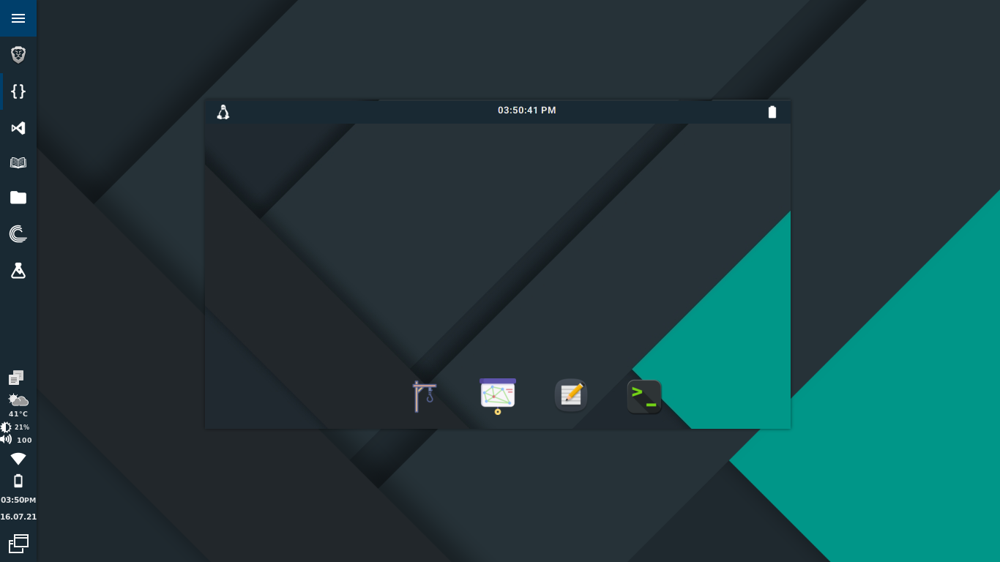

# Xaxis OS
An OS simulator that utilizes the concepts of multithreading, semaphores etc for process handling.
             
|  Main Window  |
| :-----------: |
|  |

## Features

- [x] Material UI made with glade.
- [x] C used for ultra fast performance.
- [x] Semaphores, multithreading and bankers algorithm embedded.
- [x] Builtin Custom Shell, virtual drive and ram.
- [x] Can launch linux applications and store in its virtual memory.
